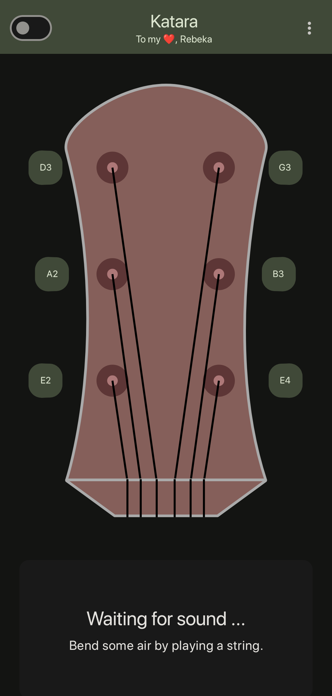
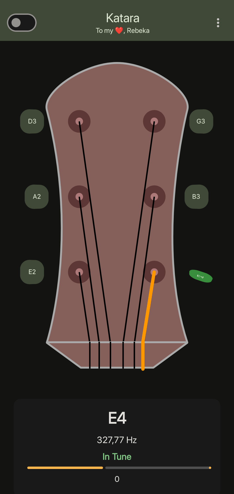
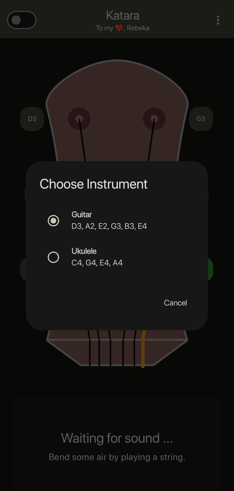
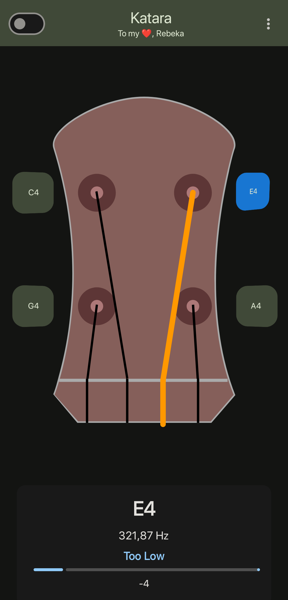

# 🎸 Katara - Musical String Instrument Tuner

## Overview

Katara is a beautiful and intuitive musical instrument tuner app for Android. It helps you tune your guitar with a clean, responsive interface and precise pitch detection.

## Features

- 🎵 Real-time pitch detection with high accuracy
- 🎸 Support for multiple instruments (Guitar, Ukulele)
- 🔄 Visual tuning feedback with animated tuning pegs
- 🎯 Cents display for precise tuning
- 📊 Clear visual indicators for tuning direction
- 🔍 Manual mode for focusing on specific strings
- 🌙 Light/Dark theme support
- 🔒 No internet permission required - works completely offline for privacy

## Screenshots

|  |  |  |
|:---:|:---:|:---:|
| Main | In tune | Manual mode switch |
|  |  |  |
| Switch instrument | Ukulele |  |

## Usage

1. Launch the app and grant microphone permission
2. Select your instrument type from the menu
3. Play a string on your instrument
4. Follow the visual guidance to tune your string:
   - 🔴 Red/Orange: Tune is too high - loosen the string
   - 🔵 Blue: Tune is too low - tighten the string
   - 🟢 Green: String is in tune!
5. Toggle manual mode to focus on tuning a specific string

## Contributing

Contributions are welcome! Feel free to submit issues or pull requests.

## Acknowledgments

- TarsosDSP library for audio processing
- Made for my ❤️, Rebeka (who also taught me to play guitar 😄)

## License

This project is licensed under the GNU General Public License v3.0 (GPL-3.0) since it uses the [TarsosDSP library](https://github.com/JorenSix/TarsosDSP) which is GPL-3.0 licensed. This means:

- You may use, modify, and distribute this software
- If you distribute this software or derivative works, you must make the source code available
- Any modifications or derivative works must also be licensed under GPL-3.0
- For the complete license text, see the LICENSE file or visit: https://www.gnu.org/licenses/gpl-3.0.html
